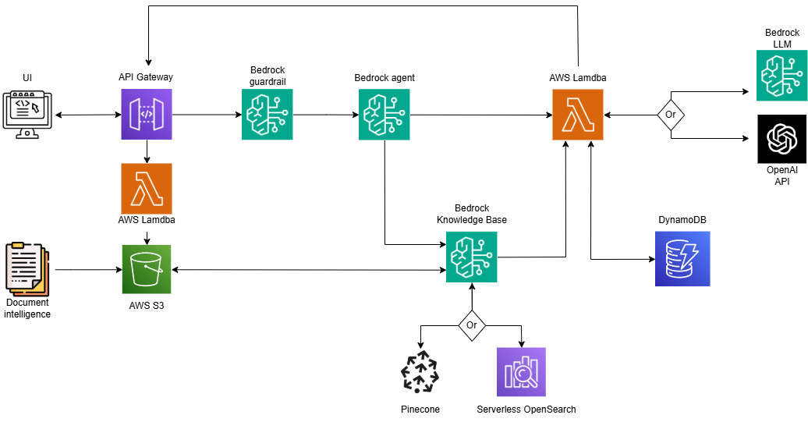

# Chatbot serverless con RAG en AWS 
## Descripción
Este proyecto que implementa **Chatbot Serverless con Retrieval-Augmented Generation (RAG)** está diseñado para responder preguntas a los usuarios de forma ajustable a cualquier tema, adaptándose al dominio específico definido por las instrucciones del modelo y los documentos almacenados en una base de conocimiento. Este proyecto se desarrolla mediante una arquitectura serverless en Amazon Web Services (AWS) y permite a los usuarios interactuar a través de una interfaz web, cargar documentos *(PDF, TXT, DOCX)* para ajustar la base de conocimiento según el tema de interés de cada usuario específico y elegir entre distintos modelos de lenguaje para generar las respuestas.
## Objetivo Principal
El objetivo del proyecto es proporcionar una herramienta flexible y personalizable que ofrezca respuestas precisas y contextualmente relevantes a preguntas sobre cualquier tema para el que sea preparado. 
## Características Principales
- **Interfaz de Usuario**: Una interfaz desarrollada con **Streamlit**, que permite a los usuarios enviar consultas de texto y cargar documentos para definir el tema de especialización.
- **Soporte para RAG**: Utiliza **AWS Bedrock Knowledge Base** para recuperar información relevante de documento almacenados en **S3**, mejorando las respuestas con contexto adicional específico del tema.
- **Selección de Modelos**: Los usuarios pueden elegir entre distintos modelos, ya sea del propio catálogo de **Bedrock** o mediante conexión a una API externa (*Claude 3.0 haiku* y *GPT-4.1 mini* respectivamente utilizados para este ejemplo desarrollado).
- **Historial de Conversación**: Almacena las últimas N interacciones de cada sesión mediante **DynamoDB**, permitiendo respuestas contextuales basadas en el historial.
- **Filtros Temáticos y Clasificación**: Implementa **Bedrock Guardrails** para restringir las consultas de los usuarios a un ámbito definido (configurable según el caso de uso) y un **Bedrock Agent** para clasificar las consultas en *simples o complejas*, definiendo así la necesidad de acceder a la base de conocimientos y reduciendo costes.
- **Referencias de Documentos**: Cuando se usan documentos de la base de conocimientos, las respuestas incluyen referencias con URLs públicas a los documentos y números de página.
## Arquitectura del Sistema
La arquitectura del proyecto es completamente serverless y está desplegada en AWS, lo que garantiza escalabilidad, bajo mantenimiento y costos optimizados. Los componentes principales son:

| Componente | Descripción | 
|--------------|--------------|
| **Front-End (Streamlit)** | Interfaz de usuario sencilla para enviar consultas, subir documentos y visualizar respuestas. Se ejecuta localmente | 
| **API Gateway** | Actúa como punto de entrada para las solicitudes HTTP desde el frontend, reenviándolas a las funciones Lambda | 
| **Backend (AWS Lambda)** | Funciones modulares que implementan la lógica del chatbot | 
|  | ``app.py``: Maneja la lógica y estructura principal del chatbot | 
|  | ``uploadFile.py``: Función encargado de manejar el flujo de los documentos subidos por el usuario de la sesión | 
|  | ``syncKnowledgeBase.py``: Invoca a un agente que actualiza la Base de Conocimientos con los nuevos documentos para que esta se mantenga actualizada | 
| **Bedrock Guardrails** | Filtra las consultas para asegurar que estén dentro del ámbito temático definido por el usuario | 
| **Bedrock Agent** | Clasifica las consultas en *SIMPLE* (no requiere contexto adicional), *COMPLEX* (requiere información de la base de conocimientos), o *NULL* (fuera de ámbito), optimizando el procesamiento | 
| **Bedrock Knowledge Base** | Gestiona documentos almacenados en S3, genera embeddings con Titan Text Embeddings V2, y realiza búsquedas semánticas para recuperar chunks relevantes según el tema | 
| **Base de datos vectorial** | Utilizada para almacenar y buscar los embeddings generados a partir de documentos en S3 | 
|  | ``Amazon OpenSearch Serverless``: Permite escalar automáticamente según la carga, proporcionando baja latencia y alta disponibilidad. Ideal para manejar un gran número de peticiones. Coste según OCUs/hora  | 
|  | ``Pinecone``: Alternativa más asequible para almacenamiento limitado en su versión gratuita | 
| **DynamoDB** | Almacena el historial de la conversación para mantener el contexto | 
| **S3** | Almacena documentos subidos por los usuarios, que se sincronizan con la Knowledge Base para especializar el chatbot en el tema deseado | 
## Flujo de Trabajo y Pasos a Seguir 
### Requisitos previos:
Antes de desplegar el chatbot, es necesario configurar los siguientes recursos en AWS para que la aplicación funcione correctamente:
- **Bucket de S3**:
    - Crea un bucket en S3 para almacenar los documentos que alimentan la base de conocimientos.
    - Sube documentos fijos iniciales que definan el conocimiento base del chatbot. Estos documentos pueden ser sobre cualquier tema en el que desees especializar el chatbot.
    - Configura permisos para que el bucket sea accesible por los servicios de Bedrock.
- **Tabla en DynamoDB**:
    - Crea una tabla de DynamoDB para almacenar el historial de conversaciones.
    - Configura la clave primaria (partition key) como ``session_id``  y una clave de ordenacion ``timestamp`` para organizar las interacciones por ID de sesión y orden temporal.
    - Asegúrate de que el rol de ejecución de Lambda tenga permisos para operaciones ``PutItem`` y ``Query`` en esta tabla`.
- **Bedrock Guardrails**:
  - Crea un Guardrail para restringir consultas a las que no quieras que el modelo genere una respuesta.
  - Configura reglas para bloquear contenido fuera de tema o sensible y establece una versión
  - Anota el ``GUARDRAIL_ID`` para usarlo posteriormente.
- **Bedrock Agent**:
  - Crea un agente con Bedrock para clasificar las consultas en *SIMPLE, COMPLEJO o NULO*.
  - Configura el agente con un modelo de clasificación (por ejemplo, Claude) y define instrucciones para clasificar consultas según su complejidad.
  - Publica el agente y obtén el ``AGENT_ID`` y ``AGENT_ALIAS_ID`` para usarlos en la Lambda.
- **Bedrock Knowledge Base**:
  - Crea una Knowledge Base en Bedrock para gestionar los documentos subidos.
  - Agrega permisos que permitan el uso completo de esta herramienta:
    - AmazonBedrockFullAccess
    - AmazonOpenSearchServiceFullAccess
    - AmazonS3FullAccess
    - EmbeddingG1
    - OpenSearchServerless
    - SecretsManagerReadWrite
  - Conecta la Knowledge Base al bucket de S3 creado anteriormente.
  - Genera dos *data sources*, uno para los documentos fijos de la base de conocimientos y otro para los documentos que suban los usuarios.
  - Configura un modelo de embeddings para generar vectores y selecciona el tamaño y overlap de tus chunks. Tienes dos opciones:
    - Utilizar los modelos de Amazon (como Titan Text Embeddings V2). Vienen con una estructura definida y tamaños de chunk predeterminados.
    - Generar una función Lambda que personalice todo este proceso y amplie las posibilidades y opciones a utilizar.
  - Elige la base de datos vectorial que más se ajuste a tus necesidades.
    - Si utilizas Pinecone conecta la api_key mediante AWS Secrets Manager.
  - Sincroniza los documentos para que se generen los embedding y habilitar búsquedas por coseno.
  - Obtén el ``KB_ID`` para utiliarlo posteriormente en la función Lambda.
- **Configurar variables de entorno**:
  - Para hacer pruebas en local crea un archivo ``.env`` con las variables obtenidas en los pasos previos.
  - Para añadir estas variables de entorno a tu lambda en la consola, y así utilizar la interfaz web puedes hacerlo desde la pestaña de ``Configuración``>``Variables de entorno``.
### Flujo de trabajo de Lambda
La función Lambda principal (``app.py``) orquesta la lógica del chatbot siguiendo estos pasos:
1. **Recibir y validar la consulta**:
    - Recibe un evento HTTP con la consulta del usuario, el ID de sesión y el modelo seleccionado.
    - Valida que estos parámetros estén presentes.
2. **Aplicar Guardrails**:
    - Usa Bedrock Guardrails para filtrar la consulta según las reglas configuradas.
    - Si la consulta no cumple (acción: ``GUARDRAIL_INTERVENED``), devuelve un mensaje indicando que está fuera de ámbito.
3. **Clasificar la consulta**:
    - Invoca el Bedrock Agent para clasificar la consulta. Primero de todo analiza si esta se ajusta al tema definido, añadiendo así una capa extra de seguridad.
    - En caso de validar la consulta, la clasifica en *SIMPLE o COMPLEX*
4. **Procesar según clasificación**:
    - Si es ``NULL``: Devuelve un mensaje indicando que la consulta no puede ser procesada.
    - Si es ``SIMPLE`` o ``COMPLEX``:
      - Recupera el historial de conversación desde DynamoDB usando ``session_id``.
      - Para ``COMPLEX``, recupera los chunks relevantes de la Knowledge Base.
      - Formatea un prompt con el historial y el contexto (si aplica).
5. **Generar y devolver respuesta:**:
    - Si el modelo seleccionado es ``bedrock``, invoca Claude a través de Bedrock para generar la respuesta.
    - Si es ``openai``, usa la API de OpenAI (GPT-4.1 mini) para generar la respuesta.
    - Para consultas ``COMPLEX``, añade referencias a los documentos de los que se obtuvo la información de la base de conocimiento (URLs públicas de S3 y número de página).
    - Muestra al usuario la respuesta generada por pantalla
6. **Almacenar interacción:**:
    - Guarda la consulta y la respuesta en **DynamoDB**, asociadas al ``session_id`` y un ``timestamp``.

Además, también existen dos funciones Lambda auxiliares que se encargan de mantener el flujo de los documentos de las Knowledge Base. Una de ellas es la encargada de, mediante la conexión a la interfaz web, subir los documentos a S3. La otra función, que se activa mediante un *trigger* cuando el bucket de S3 recibe un nuevo documento del usuario, se encarga de invocar un agente que sincronice la Knowledge Base con los nuevos documentos de forma que se generen los embeddings necesarios para poder obtener información de estos también. Las funciones encargadas de esto son ``uploadFile.py`` y ``syncKnowledgeBase.py``, respectivamente.

Finalmente, se debe configurar el **API Gateway**:
  - Crea una ``REST API`` dentro de el recurso API Gateway de AWS.
  - Genera una URL base
  - Configura dos recursos:
    - ``/chatbot``: Conecta esta ruta al método POST de la Lambda principal ``app.py`` para procesar las consultas del usuario.
    - ``/upload``: Conecta esta ruta al método POST de la Lambda encargada de subir documentos.
  - Habilita CORS para permitir solicitudes desde el frontend de Streamlit.
  - Despliega la API en un stage y obtén la URL completa.

A continuación, se muestra un esquema que representa la arquitectura del proyecto y el flujo que este sigue:
  


# POR COMPLETAR
## Instalación y Configuración
1. **Ejecutar Streamlit**
   ```
   streamlit run front/fronAWS.py
   ```
   
## Próximos pasos / Mejoras posibles
- Añadir autenticación para usuarios.
- Implementar cache de consultas frecuentes.
